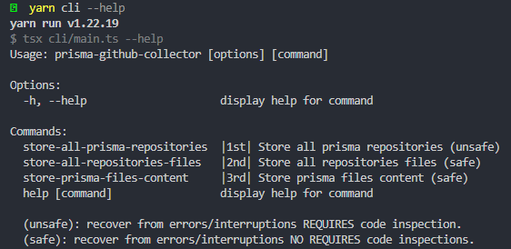
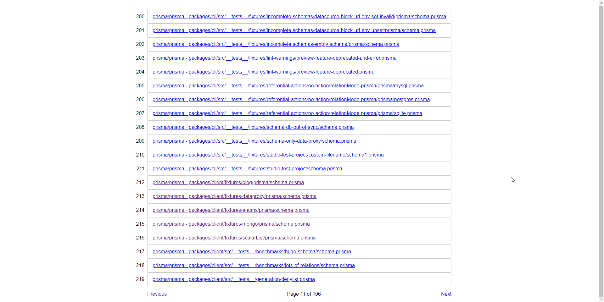
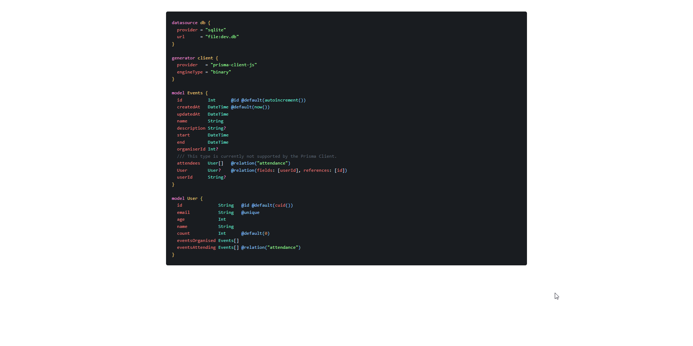

# Database Schemas Explorer

This project was created to explore the database schemas. To get started was made a github collector to create initial data. The intention is to create a web interface to explore the database schemas where the users can search, discuss and contribute to the project.

OBS: This project was created to study and for fun. This code was builded with libraries that I never used before. If you like and want to contribute, please do it. I will be very happy to receive your help.

# Get Started

Execute the CLI to collect data from github.

```powershell
# Run cli to collect data from github
yarn cli --help
```



Start the server to get access to collected data into web browser.

Server created with [Fastify](https://www.fastify.io/) and [Pug](https://pugjs.org/api/getting-started.html). The prisma hightlight is made from scratch with [tokenizr](https://www.npmjs.com/package/tokenizr). The colors was inspired by the [Atom One Dark theme](https://marketplace.visualstudio.com/items?itemName=akamud.vscode-theme-onedark).
The current database was created with [Prisma](https://www.prisma.io/) and [SQLite](https://www.sqlite.org/index.html) engine. The [database](prisma/dev.db) in this repository has a sample of 1000 repositories.

```powershell
# Run server
yarn start

# Run server in dev mode
yarn dev
```

## List of files



## File content



# Commands

```powershell
yarn init -y

# Install packages
yarn add tsx -D
yarn add @types/node -D
yarn add axios
yarn add lodash
yarn add @types/lodash -D
yarn add prisma -D
yarn add @prisma/client
yarn add commander
yarn add fastify
yarn add pug
yarn add @types/pug -D
yarn add tokenizr

# Create a new Prisma project.
npx prisma init --datasource-provider sqlite
# Create the initial migration.
npx prisma migrate dev --name init
# Turn your database schema into a Prisma schema.
npx prisma db pull
# Generate the Prisma Client. You can then start querying your database.
npx prisma generate
```

# References

- [Fastify Ecosystem](https://www.fastify.io/ecosystem/)
